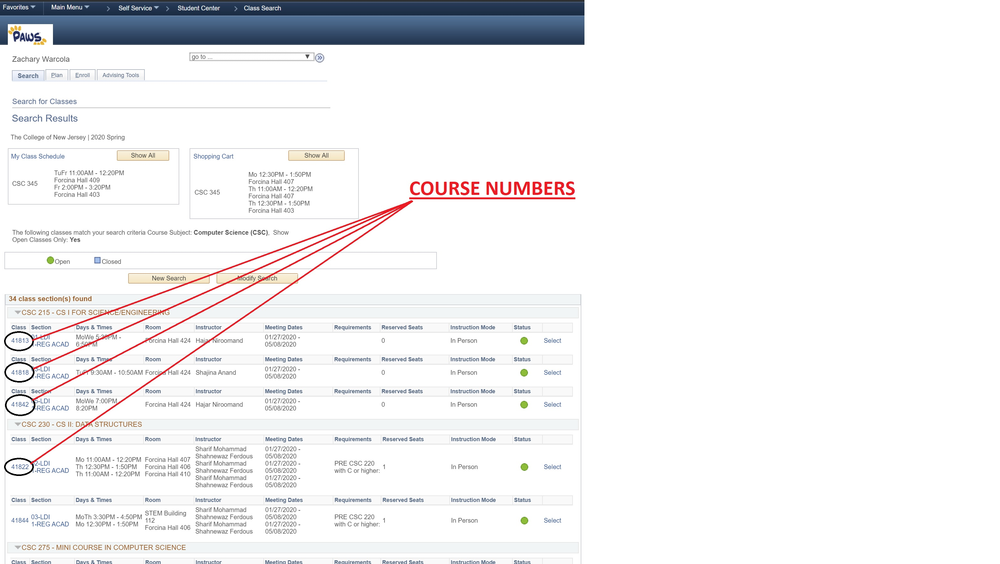

# SABRE III Peoplesoft App

Super Automated Browser Requesting Enrollment or SABRE III is an application designed to give students notifications based on if a class they with to enroll in has opened up. It is common for students to miss getting in to a class during enrollment, when they do, SABRE III is here to automatically monitor the status of the availible seats in the class. If a seat is found to be availible, the user is notified via text, email, or both about the opening.

## Using on Mac

Prerequisites: brew and python3
Follow this link:  https://docs.python-guide.org/starting/install3/osx/ to install brew and python3. Once they are both installed. Verify that python3 is installed by running "$ python3 --version". The command should return your python version. Next run mac_istall.sh by doing "$ ./mac_install.sh requirements.txt". To run the class checker, do "$ python3 class_checker.py".

## Using on Windows

Download the source code from https://github.com/zwarcola/SABREIII and run the executable within. When opened, the user will be prompted to enter their PAWS information as well as the course number. Note that this course number is the 5-digit code associated with the class name and section **NOT** the 3-digit code associated with the course type. A screenshot of where to find this code is shown below. Enter the information and click *Submit* in order to begin the program. From here, the program will check every 30 minutes if a course is availible. It is recommended to run the program on a device than can be running 24/7 to the application can always be searching.

    </img>

## Built With

* Python3 - Source Code and GUI

## Contributors

* **Jake Bezold** - *Frontend work*
* **Casey Futterman** - *Graphical User Interface*
* **Adam Varone** - *User Notification System*
* **Zachary Warcola** - *Backend Web Navigation*
